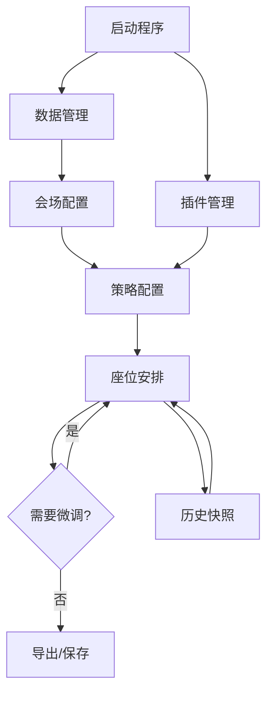

# 程序页面规划方案

基于 Avalonia UI 框架，设计模块化、清晰易用的桌面应用界面。整体采用**单窗口多视图**架构，通过导航栏切换主要功能模块，符合桌面应用操作习惯。

---

## 一、总体布局设计

### 1.1 主窗口结构

```
┌─────────────────────────────────────────────────────────────────┐
│  [菜单栏]  文件  编辑  视图  工具  帮助                            │
├─────────────────────────────────────────────────────────────────┤
│  [工具栏]  新建项目 │ 打开 │ 保存 │ 导入 │ 导出 │ 生成座位表 │ 撤消/重做  │
├───────────────┬─────────────────────────────────────────────────┤
│               │                                                 │
│   导航侧边栏   │                  内容区域                        │
│   (功能模块)   │               (当前活动视图)                      │
│               │                                                 │
│   · 数据管理   │                                                 │
│   · 会场配置   │                                                 │
│   · 策略配置   │                                                 │
│   · 座位安排   │                                                 │
│   · 历史快照   │                                                 │
│   · 插件管理   │                                                 │
│               │                                                 │
├───────────────┴─────────────────────────────────────────────────┤
│  [状态栏]  就绪 │ 当前会场: 阶梯教室 │ 学生人数: 42 │ 座位: 48/50 已分配 │
└─────────────────────────────────────────────────────────────────┘
```

### 1.2 布局说明

| 区域 | 内容 | 实现方式 |
|------|------|----------|
| 菜单栏 | 标准文件/编辑/视图等菜单 | `NativeMenu` |
| 工具栏 | 高频操作快捷按钮 | `ToolBar` + 命令绑定 |
| 导航侧边栏 | 功能模块图标+文字切换 | `ListBox` 样式定制 |
| 内容区域 | 当前选中的视图 | `ContentControl` + 数据模板 |
| 状态栏 | 全局状态信息 | `StatusBar` |

---

## 二、页面清单与导航关系

### 2.1 页面列表

| 序号 | 页面名称 | 对应 ViewModel | 功能描述 |
|------|----------|----------------|----------|
| 1 | 数据管理 | `DataManagementViewModel` | 导入/管理学生名单、查看数据统计 |
| 2 | 会场配置 | `VenueConfigurationViewModel` | 创建/编辑会场布局（网格、圆形等） |
| 3 | 策略配置 | `StrategyConfigurationViewModel` | 启用/禁用策略、调整优先级、参数配置 |
| 4 | 座位安排 | `SeatingArrangementViewModel` | 核心功能：可视化座位图、拖拽微调、生成预览 |
| 5 | 历史快照 | `SnapshotHistoryViewModel` | 查看历史版本、回滚到指定快照 |
| 6 | 插件管理 | `PluginManagementViewModel` | 管理扩展插件、脚本策略 |

### 2.2 导航流程



用户按顺序完成典型工作流：**导入数据 → 选会场 → 调策略 → 生成座位 → 微调导出**。

---

## 三、各页面详细设计

### 3.1 数据管理页

**核心功能**：导入学生名单、查看/编辑数据、数据校验。

```
┌─────────────────────────────────────────────────────────────┐
│  [导入] [导出] [验证数据] [清空]                              │
├─────────────────────────────────────────────────────────────┤
│  数据源: C:\Users\...\students.xlsx        [浏览] [重新加载]  │
├─────────────────────────────────────────────────────────────┤
│  ┌───────┬────────┬──────┬──────┬──────────┬──────────┐    │
│  │ 学号  │  姓名  │ 性别 │ 身高 │ 需前排？ │ 同桌组ID │    │
│  ├───────┼────────┼──────┼──────┼──────────┼──────────┤    │
│  │ S001  │ 张三   │ 男   │ 175  │   否     │   G1     │    │
│  │ S002  │ 李四   │ 女   │ 162  │   是     │   G1     │    │
│  │ ...   │ ...    │ ...  │ ...  │   ...    │   ...    │    │
│  └───────┴────────┴──────┴──────┴──────────┴──────────┘    │
├─────────────────────────────────────────────────────────────┤
│  统计: 总人数 42 │ 男生 20 │ 女生 22 │ 需前排 5 │ 同桌组 8   │
│  验证结果: ⚠️ 发现 2 条警告 (身高数据缺失)                   │
└─────────────────────────────────────────────────────────────┘
```

**关键控件**：
- `DataGrid` 展示学生列表，支持单元格编辑。
- 导入按钮调用文件选择器，支持 .xlsx/.csv/.json。
- 验证结果区域显示错误/警告列表。

**ViewModel 职责**：
- 维护 `ObservableCollection<Student>`。
- 处理导入导出命令。
- 调用 `IDataValidator` 并展示结果。

---

### 3.2 会场配置页

**核心功能**：选择或创建教室布局，设置座位参数，预览布局。

```
┌─────────────────────────────────────────────────────────────┐
│  会场类型: [网格 ▼] [圆形 ▼] [自由点 ▼]           [新建] [编辑] │
├─────────────────────────────────────────────────────────────┤
│  配置面板:                                                   │
│  ┌─────────────────────────┐  ┌───────────────────────────┐ │
│  │ 布局参数:                │  │                           │ │
│  │  行数: 6                │  │      [布局预览图]          │ │
│  │  列数: 8                │  │                           │ │
│  │  座位间距: 60px         │  │     ● ● ● ● ● ● ● ●       │ │
│  │  起始偏移: (50, 50)     │  │     ● ● ● ● ● ● ● ●       │ │
│  │                         │  │     ● ● ● ● ● ● ● ●       │ │
│  │  障碍物:                │  │     ● ● ● ● ● ● ● ●       │ │
│  │    + 添加障碍物         │  │                           │ │
│  │    - 讲台 (0,0)-(2,8)   │  │                           │ │
│  └─────────────────────────┘  └───────────────────────────┘ │
├─────────────────────────────────────────────────────────────┤
│  [保存会场] [另存为...] [测试布局]                            │
└─────────────────────────────────────────────────────────────┘
```

**关键控件**：
- 布局类型下拉选择。
- 参数输入（数字框、滑块）。
- 障碍物列表（可编辑）。
- 画布预览区域（使用 Avalonia `Canvas` 绘制座位）。

**ViewModel 职责**：
- 根据布局类型动态切换参数面板。
- 实时生成预览座位集合。
- 调用 `ILayoutBuilder` 生成布局定义并保存为 `.venue.json`。

---

### 3.3 策略配置页

**核心功能**：启用/禁用策略，调整执行顺序，配置各策略参数。

```
┌─────────────────────────────────────────────────────────────┐
│  可用策略:                                                   │
│  ┌─────────────────────────────────────────────────────┐    │
│  │ 启用 │ 优先级 │ 策略名称              │ 状态        │    │
│  │ [✓] │   10  │ 固定座位策略          │ 已配置      │    │
│  │ [✓] │   20  │ 前排轮换策略          │ 已配置      │    │
│  │ [✓] │   30  │ 同桌靠近策略          │ 已配置      │    │
│  │ [ ] │   40  │ 随机填充策略          │ 未启用      │    │
│  │ [✓] │   50  │ Lua脚本:视力优先      │ 已加载      │    │
│  └─────────────────────────────────────────────────────┘    │
│                              [上移] [下移] [配置] [删除]     │
├─────────────────────────────────────────────────────────────┤
│  当前选中策略配置: [固定座位策略]                              │
│  ┌─────────────────────────────────────────────────────────┐│
│  │  固定座位映射:                                           ││
│  │  ┌─────────────┬─────────────┐                          ││
│  │  │ 座位ID      │ 学生ID      │                          ││
│  │  ├─────────────┼─────────────┤                          ││
│  │  │ A1          │ S001(张三)  │ [选择]                   ││
│  │  │ B3          │ S005(王五)  │ [选择]                   ││
│  │  │ ...         │ ...         │                          ││
│  │  └─────────────┴─────────────┘                          ││
│  │                                    [添加映射]            ││
│  └─────────────────────────────────────────────────────────┘│
└─────────────────────────────────────────────────────────────┘
```

**关键控件**：
- `DataGrid` 展示策略列表，支持拖拽排序（优先级）。
- 右侧动态配置面板，根据策略类型显示不同编辑器（使用 `ContentControl` + `DataTemplate` 选择器）。
- 固定座位策略提供座位-学生选择器。

**ViewModel 职责**：
- 从 `IPluginManager` 获取所有可用策略。
- 维护策略启用/优先级状态。
- 为每个策略提供配置编辑能力。

---

### 3.4 座位安排页（核心页面）

**核心功能**：可视化座位图、拖拽交换、手动分配、生成座位表、查看轮换历史。

```
┌─────────────────────────────────────────────────────────────┐
│  [生成座位表] [开始轮换] [清空分配] [导出视图...]   缩放: [+] [-]│
├─────────────────────────────────────────────────────────────┤
│  ┌───────────────────────────────────────────────────────┐  │
│  │                                                       │  │
│  │              [可视化座位画布区域]                       │  │
│  │                                                       │  │
│  │      (根据布局类型绘制座位，显示学生姓名或头像)           │  │
│  │                                                       │  │
│  │                                                       │  │
│  └───────────────────────────────────────────────────────┘  │
├───────────────────────────────┬─────────────────────────────┤
│  未分配学生列表 (5人)          │  座位信息 / 轮换建议         │
│  ┌──────────────────────┐     │  选中座位: A3                │
│  │ 张三 (S001) [拖拽]    │     │  当前分配: 李四 (S002)       │
│  │ 王五 (S005)           │     │  历史记录: A1 → B2 → A3     │
│  │ ...                   │     │  前排累计: 2 次             │
│  └──────────────────────┘     │  [查看该生轮换详情]          │
│                               │                             │
│  筛选: [全部 ▼] [仅未分配]     │  轮换建议:                   │
│                               │  · 建议与 C3 的赵六交换       │
│                               │  · 上次座位为 B2，距离适中    │
└───────────────────────────────┴─────────────────────────────┘
```

**关键交互**：
- **拖拽分配**：从未分配列表拖拽学生到空座位；座位间拖拽交换学生。
- **右键菜单**：清空座位、固定/取消固定、查看学生详情。
- **悬浮提示**：鼠标悬停在座位上显示学生详细信息。
- **缩放平移**：支持鼠标滚轮缩放，按住中键拖拽平移视图。

**ViewModel 职责**：
- 维护 `SeatingWorkspace` 实例。
- 响应拖拽命令，更新分配映射。
- 调用策略执行管道生成初始座位。
- 与 `CommandHistory` 交互支持撤销/重做。
- 计算轮换建议（可调用分析服务）。

---

### 3.5 历史快照页

**核心功能**：查看保存的历史版本，对比差异，回滚。

```
┌─────────────────────────────────────────────────────────────┐
│  会场: 阶梯教室          [刷新] [对比]                        │
├─────────────────────────────────────────────────────────────┤
│  ┌────────────────────────────────────────────────────┐     │
│  │ 创建时间           │ 描述           │ 分配数 │ 操作  │     │
│  ├────────────────────┼────────────────┼────────┼───────┤     │
│  │ 2026-04-15 10:23  │ 月考座位表     │ 42/48 │ [查看]│     │
│  │ 2026-04-10 14:02  │ 日常轮换第3周   │ 41/48 │ [查看]│     │
│  │ 2026-04-03 09:15  │ 初始座位        │ 40/48 │ [查看]│     │
│  └────────────────────────────────────────────────────┘     │
├─────────────────────────────────────────────────────────────┤
│  选中快照预览: [2026-04-15 月考座位表]                        │
│  ┌─────────────────────────┐  ┌───────────────────────────┐ │
│  │ 缩略座位图               │  │ 变更摘要:                 │ │
│  │ (小尺寸网格预览)         │  │  新增固定: 2 个           │ │
│  │                         │  │  座位交换: 5 对           │ │
│  │                         │  │  未分配: 6 座             │ │
│  └─────────────────────────┘  └───────────────────────────┘ │
│                                                             │
│                    [应用此快照] [另存为新方案]                │
└─────────────────────────────────────────────────────────────┘
```

**ViewModel 职责**：
- 调用 `ISnapshotRepository` 获取快照列表。
- 生成快照预览缩略图。
- 处理回滚操作。

---

### 3.6 插件管理页

**核心功能**：查看已安装插件、启用/禁用、安装新插件、配置脚本。

```
┌─────────────────────────────────────────────────────────────┐
│  [安装插件...] [扫描目录] [启用所有] [禁用所有]                │
├─────────────────────────────────────────────────────────────┤
│  ┌───────────────────────────────────────────────────────┐  │
│  │ 状态 │ 名称              │ 版本  │ 类型      │ 优先级 │  │
│  │ [✓] │ 视力优先策略       │ 1.0.0 │ Lua脚本   │   25  │  │
│  │ [✓] │ 男女间隔策略       │ 2.1.0 │ DLL插件   │   15  │  │
│  │ [!] │ 身高排序策略       │ 1.0.0 │ 错误      │   -   │  │
│  └───────────────────────────────────────────────────────┘  │
├─────────────────────────────────────────────────────────────┤
│  插件详情: 视力优先策略                                       │
│  ┌─────────────────────────────────────────────────────────┐│
│  │ 描述: 根据学生视力需求优先安排前排座位                     ││
│  │ 作者: dev@example.com                                   ││
│  │ 脚本文件: vision_first.lua            [编辑脚本] [重载]   ││
│  │ 配置参数:                                                ││
│  │   视力阈值: 0.3              [保存]                      ││
│  │   优先级偏移: 5                                         ││
│  └─────────────────────────────────────────────────────────┘│
│                                                             │
│  错误信息: 身高排序策略加载失败 - 缺少依赖程序集                │
└─────────────────────────────────────────────────────────────┘
```

**ViewModel 职责**：
- 调用 `IPluginManager` 获取插件清单。
- 处理插件启用/禁用。
- 对于脚本插件，提供简单的文本编辑器。

---

## 四、辅助窗口与对话框

| 对话框名称 | 用途 | 关键内容 |
|------------|------|----------|
| 进度对话框 | 显示长时间操作进度 | 进度条、状态文本、取消按钮 |
| 数据导入向导 | 分步导入数据 | 文件选择→字段映射→预览→完成 |
| 会场创建向导 | 快速创建标准布局 | 类型选择→参数输入→预览 |
| 导出选项对话框 | 设置导出格式 | 格式选择（PDF/Excel/图片）、页面设置、是否匿名化 |
| 策略冲突解决对话框 | 处理固定座位冲突 | 冲突列表、解决方案选项（覆盖/保留/取消） |
| 关于对话框 | 显示版本信息 | 版本号、开源协议、第三方库致谢 |

---

## 五、ViewModel 与路由设计

### 5.1 导航服务

```csharp
public interface INavigationService
{
    void NavigateTo<TViewModel>() where TViewModel : ViewModelBase;
    void NavigateTo<TViewModel>(object parameter) where TViewModel : ViewModelBase;
    bool CanGoBack { get; }
    void GoBack();
}

// 实现中使用 DI 容器解析 ViewModel，并通过 ContentControl 切换内容
```

### 5.2 主窗口 ViewModel

```csharp
public class MainWindowViewModel : ViewModelBase
{
    public INavigationService Navigation { get; }
    public ICommand NewProjectCommand { get; }
    public ICommand OpenProjectCommand { get; }
    public ICommand SaveCommand { get; }
    public ICommand GenerateSeatingCommand { get; }
    public ICommand UndoCommand { get; }
    public ICommand RedoCommand { get; }
    
    // 全局状态属性
    public string StatusMessage { get; set; }
    public string CurrentVenueName { get; set; }
    public int TotalStudents { get; set; }
    public int AssignedSeats { get; set; }
}
```

### 5.3 ViewModel 基类

继承 `ReactiveObject`（ReactiveUI）或 `ObservableObject`（CommunityToolkit.Mvvm），实现 `INotifyPropertyChanged`，提供通用功能如 `IsBusy`、错误处理等。

---

## 六、数据绑定与命令示例

### 6.1 数据管理页数据网格绑定

```xml
<DataGrid ItemsSource="{Binding Students}" 
          SelectedItem="{Binding SelectedStudent}"
          CanUserResizeColumns="True">
    <DataGrid.Columns>
        <DataGridTextColumn Header="学号" Binding="{Binding Id}" />
        <DataGridTextColumn Header="姓名" Binding="{Binding Name}" />
        <DataGridComboBoxColumn Header="性别" 
                                ItemsSource="{Binding GenderOptions}"
                                SelectedItemBinding="{Binding Gender}" />
        <DataGridCheckBoxColumn Header="需前排？" Binding="{Binding NeedsFrontRow}" />
    </DataGrid.Columns>
</DataGrid>
```

### 6.2 命令绑定（导入按钮）

```xml
<Button Content="导入" Command="{Binding ImportCommand}" />
```

```csharp
public ICommand ImportCommand => ReactiveCommand.CreateFromTask(ImportAsync);

private async Task ImportAsync()
{
    var dialog = new OpenFileDialog();
    dialog.Filters.Add(new FileDialogFilter() { Name = "Excel", Extensions = { "xlsx" } });
    var result = await dialog.ShowAsync(GetWindow());
    if (result != null)
    {
        await LoadStudentsAsync(result[0]);
    }
}
```

---

## 七、UI 样式与主题

### 7.1 主题支持

- 内置 Fluent 主题（亮色/暗色），通过 Avalonia 的 `FluentTheme` 实现。
- 使用 `ThemeVariant` 支持系统主题跟随。

### 7.2 自定义控件

| 控件名称 | 用途 | 说明 |
|----------|------|------|
| `SeatControl` | 单个座位可视化 | 继承 `ContentControl`，根据 `Seat` 类型渲染不同形状 |
| `SeatingCanvas` | 座位画布容器 | 继承 `Canvas`，处理拖拽事件、缩放平移 |
| `StrategyConfigurator` | 策略配置面板宿主 | 根据策略类型动态加载对应的配置控件 |

---

## 八、响应式与平台适配

- **窗口大小适应**：使用 `Grid` 和 `DockPanel` 实现自适应布局，内容区域最小尺寸 1024×768。
- **平台差异处理**：
  - 菜单栏在 macOS 上自动转换为系统菜单栏。
  - 文件路径使用 `Path.DirectorySeparatorChar` 处理。
  - 密钥存储使用平台特定 API 封装。

---

## 九、页面状态持久化

在关闭应用时，保存当前会话状态：

- 最后打开的文件路径。
- 侧边栏折叠状态。
- 座位安排页的缩放/平移位置。
- 窗口大小和位置。

使用 `AppSettings.json` 或独立 `session.json` 存储。

---

此页面规划方案覆盖了应用的所有核心功能界面，结构清晰，易于扩展，可直接作为开发团队的实现参考。