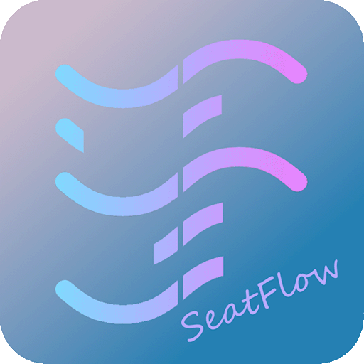

<!-- markdownlint-disable MD033 MD041 -->
<div align="center">

#  SeatFlow - 座流

**跨平台桌面座位安排与轮换系统**  
自动/手动排座 · 多数据源导入导出 · 策略引擎 · 历史快照回滚

[](https://github.com/Helio-RC/Seatflow/releases)
[](https://github.com/Helio-RC/Seatflow/stargazers)
[](https://dotnet.microsoft.com/download/dotnet/10.0)
[](LICENSE)
[](https://github.com/Helio-RC/Seatflow)
[](https://github.com/Helio-RC/Seatflow)
[](https://qm.qq.com/q/y9D63B0dYk)

</div>

> [!TIP]
> **💬 QQ 交流群**：[761175549](https://qm.qq.com/q/y9D63B0dYk)  
> - 欢迎大家前来反馈问题、提出建议，或者一起吹水聊天！  
> - 若Github的下载速度过慢，也可以进群下载。

## ✨ 核心功能

- [x] **多格式数据导入** — CSV、Excel（XLSX）、JSON 学生名单导入
- [x] **智能排座引擎** — 7 条内置策略管道执行（4 独立 + 3 依赖）：固定座位、前排轮换、性别限制、同桌分组、同桌上一次、随机填充、碎片整理；策略按优先级 Fill-in-Order 模型执行
- [x] **插件扩展** — 第三方可通过 DLL、Lua 脚本、C# 脚本编写自定义排座策略，拖入即用
- [x] **手动微调** — 拖拽交换座位，全功能撤销/重做
- [x] **多种布局** — 网格、环形/扇形、自由点教室布局；支持障碍物（柱子、讲台）
- [x] **多格式导出** — Excel、CSV、PDF、图片导出座位表
- [x] **历史快照** — 手动保存排座快照，支持回滚到任意历史版本
- [x] **配置驱动** — 策略优先级、布局参数、导出选项均可配置
- [x] **跨平台** — Windows / macOS / Linux 原生运行

---

## 🚀 快速开始

> [!IMPORTANT]
> **环境要求**
> - [.NET 10 SDK](https://dotnet.microsoft.com/download/dotnet/10.0)
> - Windows 11 / macOS 14+ / Ubuntu 22.04+（或其他 Linux 发行版）

**构建与运行**

```bash
git clone https://github.com/Helio-RC/Seatflow.git
cd SeatFlow
dotnet build
dotnet run --project SeatFlow.Presentation.Avalonia
```

**运行测试**

```bash
dotnet test
```

## 🤝 反馈与贡献

- **Bug 反馈**：请在 [GitHub Issues](https://github.com/Helio-RC/Seatflow/issues) 提交，附上操作系统版本和复现步骤，最好能附上日志
- **功能建议**：欢迎提交 Feature Request
- **界面美化**：初代开发者审美不好，欢迎各位大能贡献 UI 设计和图标资源
- **插件开发**：参见 [SeatFlow.Plugins.Sdk/docs/README.md](SeatFlow.Plugins.Sdk/docs/README.md) 插件开发指南 `尚未完善 🚧 部分支持`
- **参与开发**：参见 [CONTRIBUTING.md](CONTRIBUTING.md) 了解构建环境、项目结构和编码规范
- **AI 辅助开发**：本项目使用 Claude Code & Deepseek V4 preview 辅助开发。项目级 AI 配置位于 [CLAUDE.md](CLAUDE.md)，包含架构约定、代码模式和开发命令。建议 AI 开发者先阅读此文件和 [docs/adr/](docs/adr/) 中的架构决策记录

## 🧱 技术概要

.NET 10 + Avalonia 12 + CommunityToolkit.Mvvm，分层架构，外观模式统一入口，命令模式实现撤销/重做。

```
Presentation (Avalonia UI)  ← 用户界面、MVVM
        ↓  IApplicationFacade
Application                 ← 编排、策略管道、命令栈
   ↓            ↓
Core           Infrastructure
领域模型        文件 I/O、布局生成器
策略接口        导出器、仓库、迁移
```

| 层 | 职责 |
|----|------|
| **Core** | 领域实体（`Student`, `Seat`）、策略接口、领域服务 |
| **Application** | 外观模式入口、策略管道、插件管理、撤销/重做 |
| **Infrastructure** | CSV/Excel/JSON 导入导出、网格/环形/自由布局构建、PDF/图片导出、文件版本迁移 |
| **Presentation** | Avalonia 12 桌面 UI、MVVM（CommunityToolkit.Mvvm）、编译绑定 |

## ⚖️ 许可

MIT License © 2026 SeatFlow Contributors

## 📚 项目文档

| 文档 | 说明 |
|------|------|
| [docs/INDEX.md](docs/INDEX.md) | 文档导航地图（修改文档前先查阅联动规则） |
| [ARCHITECTURE.md](ARCHITECTURE.md) | 项目目标与架构设计 |
| [docs/Phases.md](docs/Phases.md) | 实现阶段与详细规划 |
| [CONTRIBUTING.md](CONTRIBUTING.md) | 开发环境搭建与参与指南 |
| [CLAUDE.md](CLAUDE.md) | AI 编码助手配置 |
| [CHANGELOG.md](CHANGELOG.md) | 变更日志 |
| [docs/adr/](docs/adr/) | 架构决策记录 |
| [Design_Spec.md](SeatFlow.Presentation.Avalonia/docs/Design_Spec.md) | UI 设计规范 |
| [Fluent_Icons.md](SeatFlow.Presentation.Avalonia/docs/Fluent_Icons.md) | 图标参考 |
| [Plugins.Sdk/README.md](SeatFlow.Plugins.Sdk/docs/README.md) | 插件开发 SDK 文档 |

---

<div align="center">
Made with ❤️ by SeatFlow Contributors
</div>